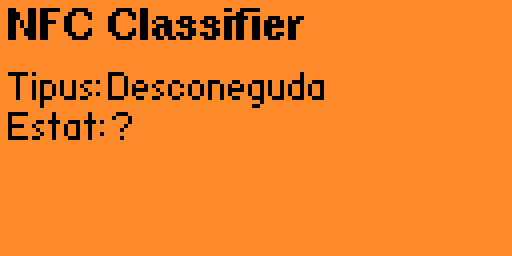
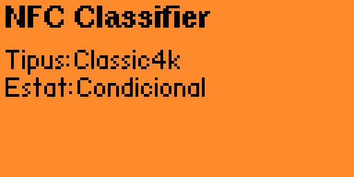
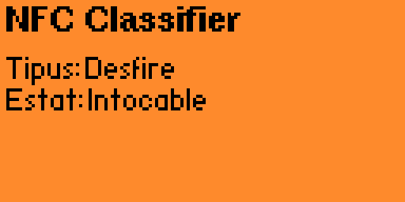

# NFC Classifier

A Flipper Zero application (FAP) that identifies an NFC/RFID card and tells you,
at a glance, whether it can be cloned. Hold a card to the Flipper: the app reads
its low-level identifiers, classifies the chip family, and shows a verdict.

Built from scratch in C as a learning project, on top of the modern unified NFC
stack (official firmware 1.4.3) and built with [`ufbt`](https://pypi.org/project/ufbt/).

## The security traffic light

The core idea is a traffic light for cloneability. Every card falls into one of
three levels:

| Level | Meaning | Cards |
|-------|---------|-------|
| Green | Clonable. No real encryption, the whole card can be read and copied. | Ultralight / NTAG |
| Amber | Conditional. Crypto1 is broken, but it depends on the keys: default or known keys can be recovered card-in-hand; custom keys need capturing a legitimate reader. | MIFARE Classic 1K / 4K |
| Red | Untouchable. Strong encryption with mutual authentication, not clonable in practice. | DESFire (EV3) |

The Flipper screen is monochrome, so the level is shown as words rather than
colour. On-device labels are in Catalan: `Clonable`, `Condicional`, `Intocable`.

The guiding principle is simple: **the app always classifies, and only acts when
the case allows it.** It never promises to break what cannot be broken.

## Screenshots

> Captured with qFlipper. 

| No card yet | MIFARE Classic 1K | DESFire (residence key) |
|-------------|-------------------|-------------------------|
|  |  |  |

## How classification works

The app does not rely on a library saying "this is a Classic". It reads the raw
handshake and decides for itself, from two inputs:

- the **SAK** byte returned during ISO/IEC 14443-3 anticollision, and
- whether the card supports **ISO/IEC 14443-4** (higher-layer protocol).

| Input | Result |
|-------|--------|
| Supports ISO14443-4 (SAK bit `0x20` set) | DESFire family -> Red |
| SAK `0x00` | Ultralight / NTAG -> Green |
| SAK `0x08` | MIFARE Classic 1K -> Amber |
| SAK `0x18` | MIFARE Classic 4K -> Amber |
| anything else | Unknown |

ISO14443-4 support is checked first on purpose: a card that speaks layer 4 is
DESFire family whatever its SAK says. This matters because on DESFire EV3 the SAK
is configurable, so it cannot be trusted for type identification on its own. The
SAK values follow NXP application note AN10833 ("MIFARE Type Identification
Procedure").

## Architecture

Responsibilities are split into modules that do not depend on each other's
internals:

- **`card_reader`** - the only module that touches hardware. It runs a worker
  thread that performs a synchronous ISO14443-3A read in a loop, extracts the raw
  SAK and the ISO14443-4 flag, and hands them out through a callback. Everything
  NFC-specific is hidden behind an opaque type.
- **`classifier`** - pure functions, no hardware. `classify(sak, iso4)` returns a
  card type, `assess(type)` returns a verdict. Fully testable off-device.
- **main / UI** - the screen and the event loop. A single message queue carries
  both button events and card-found events between threads, so the reader never
  touches the screen directly.

```
Scan  ->  Classify  ->  Show verdict  ->  (if applicable) Act  ->  Save
```

## Build and run

Requires the official firmware **1.4.3** on the Flipper and `ufbt` on your
machine.

```bash
# install the build tool (once)
pipx install ufbt
ufbt update            # downloads the SDK for the release channel (1.4.3)

# from the project folder (the one with application.fam)
ufbt                   # build -> ./dist/nfc_classifier.fap
ufbt launch            # build, upload and run over USB (close qFlipper first)
```

Logs are visible with `ufbt cli` and then the `log` command.


## Responsible use

This is a personal learning tool, meant for cards you own and for understanding
how card security works. It reports what is and is not cloneable, and it does not
attempt to break cards that are secure by design.